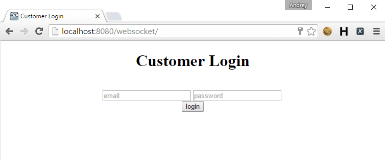
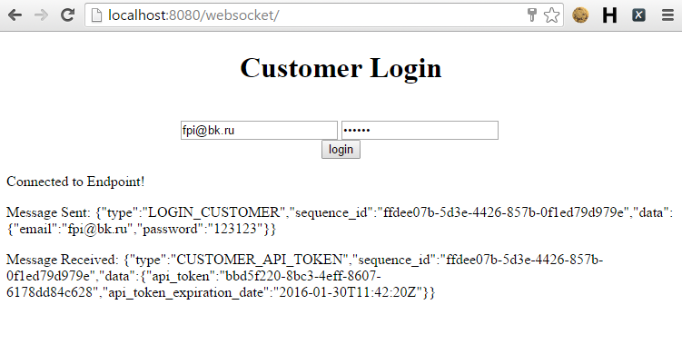
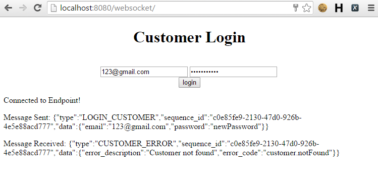
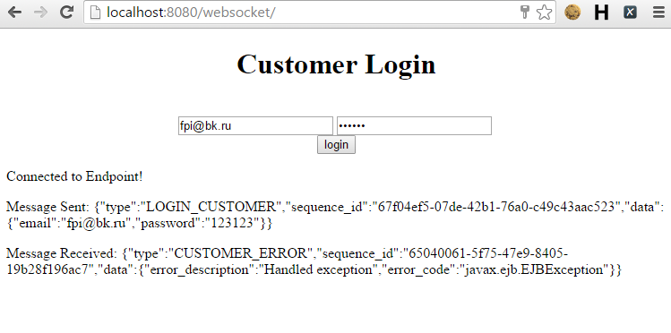
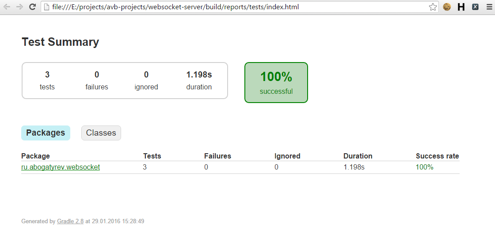
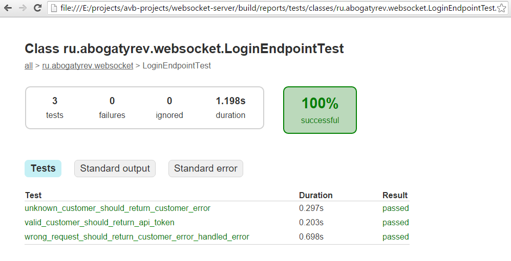
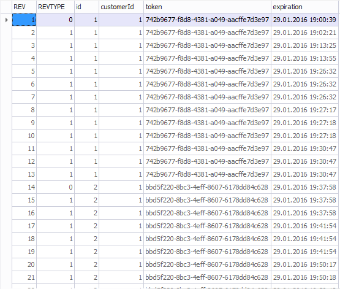

WebSocket Login Customer demo
=============================
Демонстрационное серверное приложение осуществляющее операцию аутентификацию пользователя.   
  Взаимодействие клиент/сервер происходит по протоколу WebSocket в определенном формате JSON.
  
  Используются следующие инструменты и технологии:
  
   * [WildFly Application server](http://wildfly.org/)
   * [MySQL database](http://dev.mysql.com/)
   * сборка с помощью [Gradle](http://gradle.org/)
   * контроль изменений структуры БД с помощью [Liquibase](http://www.liquibase.org/)
   * тестирование с помощью [Arquillian](http://arquillian.org/)
   * [Hibernate ORM](http://hibernate.org/orm/)
   * [Envers](http://hibernate.org/orm/envers/) для хранения истории токенов пользователей
  
Содержание
----------
* [Подготовка среды демонстрации](#подготовка-среды-демонстрации)
* [Установка проекта](#установка-проекта)
* [Сборка и развертывание (build and deploy)](#Сборка и развертывание (build and deploy))
* [Проверка работоспособности](#Проверка работоспособности)
* [Выполнение Arquillian тестов](#Выполнение Arquillian тестов)
* [История токенов пользователей](#История токенов пользователей)
* [Database DDL](#7)
* [Полезные материалы](#полезные-материалы)
  
Подготовка среды демонстрации
-----------------------------
* установить [Java SDK](http://www.oracle.com/technetwork/java/javase/downloads/jdk8-downloads-2133151.html)
* установить [Wildfly](http://wildfly.org/downloads/) _(тестирование и отладка производилась на Wildfly v8.2.1.Final)_
* установить сервер БД [MySQL](http://dev.mysql.com/downloads/mysql/) _(дальнейшие настройки соединения с БД предполагают работу сервера локально на порту 3306, 'localhost:3306')_
* настроить переменные среды _**JAVA_HOME**_
* в папке проекта _'websocket-server'_ скорректировать значения в файле настроек _gradle.properties_: секции _"Wildlfly config"_ и _"Luqibase config"_

Установка проекта
-----------------
* запустить сервер WildFly:
> для Linux:  ```WILDFLY_HOME/bin/standalone.sh -c standalone.xml```
> для Windows:  ```WILDFLY_HOME\bin\standalone.bat -c standalone.xml```
* в папке проекта _'websocket-server'_ выполнить скрипт конфигурации сервиса:
> для Linux:  ```WILDFLY_HOME/bin/jboss-cli.bat --connect --file=configure-server.cli```
> для Windows:  ```WILDFLY_HOME\bin\jboss-cli.bat --connect --file=configure-server.cli```
* убедиться что сервер БД MySQL запущен
* в папке проекта _'websocket-server'_ выполнить команду для настройки таблиц БД: ```gradlew update```

Сборка и развертывание (build and deploy)
-----------------------------------------
В папке проекта _'websocket-server'_ выполнить команду:
```
gradlew deployToWildfly
```

Зайти в браузере по адресу http://localhost:8080/websocket/ _(предполагается, что сервер WildFly запущен с оспользованием web порта 8080)_   
Если все было выполнено правильно, должна открыться страница вида:



Проверка работоспособности
--------------------------

* Успешный сценарий аутентификации пользователя _(Для тестов в БД внесен пользователь: email: fpi@bk.ru, password: 123123)_ 
> При повторной аутентификации, сервис обновляет время действия существующего, валидного токена. Если токен не валидный (когда его время истекло), создается новый токен.

```
вводим email "fpi@bk.ru" и  password "123213", нажимаем кнопку "login"
```



* Не успешный сценарий аудентификации пользователя
```
вводим email "123@gmail.com" и password "newPassword", нажимаем кнопку "login"
```



* Сценарий обработки ошибок
```
останавливаем БД, нажимаем кнопку "login"
```




Выполнение Arquillian тестов
----------------------------
* **остановить сервер WildFly**, серве БД MySQL должен быть запущен
* В папке проекта _'websocket-server'_ выполнить команду:
```
gradlew testWebsocket
```

Результаты тестов доступны в папке проекта _'websocket-server/build/reports/tests/index.html'_





История токенов пользователей
-----------------------------
Хранение истории изменений токенов пользователей происходит в БД, в таблице "ApiToken_AUD". Изменения сохраняются автоматически, с помощью [Envers](http://hibernate.org/orm/envers/).



#7
Database DDL
------------
```
CREATE TABLE Customer (
  id bigint(20) NOT NULL AUTO_INCREMENT,
  email varchar(255) NOT NULL,
  password varchar(255) NOT NULL,
  PRIMARY KEY (id),
  UNIQUE INDEX customerEmailIDX (email)
)
ENGINE = INNODB
CHARACTER SET utf8
COLLATE utf8_general_ci;
```

```
CREATE TABLE ApiToken (
  id bigint(20) NOT NULL AUTO_INCREMENT,
  customerId bigint(20) NOT NULL,
  token varchar(255) NOT NULL,
  expiration datetime NOT NULL,
  PRIMARY KEY (id),
  UNIQUE INDEX apiTokenIDX (token),
  CONSTRAINT ApiTokenCustomerFK FOREIGN KEY (customerId)
  REFERENCES websocket_demo.customer (id) ON DELETE RESTRICT ON UPDATE RESTRICT
)
ENGINE = INNODB
CHARACTER SET utf8
COLLATE utf8_general_ci;
```

```
CREATE TABLE ApiToken_AUD (
  REV int(11) DEFAULT NULL,
  REVTYPE tinyint(4) DEFAULT NULL,
  id bigint(20) DEFAULT NULL,
  customerId bigint(20) DEFAULT NULL,
  token varchar(255) DEFAULT NULL,
  expiration datetime DEFAULT NULL
)
ENGINE = INNODB
CHARACTER SET utf8
COLLATE utf8_general_ci;
```

```
CREATE TABLE REVINFO (
  REV int(11) NOT NULL AUTO_INCREMENT,
  REVTSTMP bigint(20) DEFAULT NULL,
  PRIMARY KEY (REV)
)
ENGINE = INNODB
CHARACTER SET utf8
COLLATE utf8_general_ci;
```

Полезные материалы   
-------------------
http://www.mastertheboss.com/javaee/websockets/websockets-tutorial-on-wildfly-8?showall=&start=1   
http://jlunaquiroga.blogspot.ru/2014/05/websockets-in-jee-7-with-wildfly.html   
http://mgreau.com/posts/2013/11/11/javaee7-websocket-angularjs-wildfly.html   
https://github.com/mgreau/javaee7-websocket   
https://github.com/javaee-samples/javaee7-samples/tree/master/websocket
